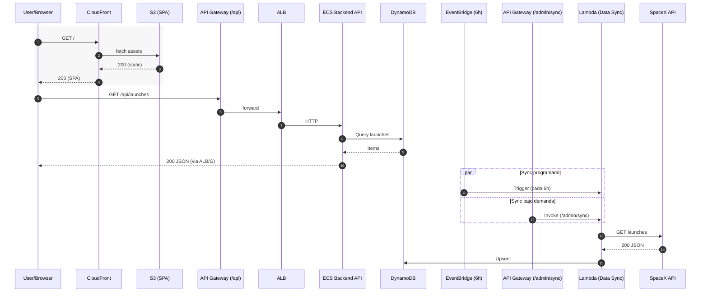

# 🚀 SpaceX Launches - Full Stack Application

Una aplicación full-stack para consultar y visualizar información de lanzamientos de SpaceX, desplegada en AWS con infraestructura como código.

## 📋 Descripción General

Este proyecto implementa una solución completa que incluye:

- **Frontend**: Aplicación Angular desplegada en S3 + CloudFront
- **Backend**: API REST en Spring Boot desplegada en ECS Fargate
- **Lambda**: Función de sincronización de datos desde la API pública de SpaceX
- **Infraestructura**: CloudFormation templates para despliegue automatizado
- **CI/CD**: GitHub Actions para deployment automático

## 🏗️ Arquitectura




## 🛠️ Stack Tecnológico

### Frontend
- **Angular 20.2.1** - Framework principal
- **TypeScript** - Lenguaje de programación
- **TailwindCSS** - Framework de estilos utility-first
- **Preline UI** - Componentes y elementos de interfaz
- **Jest** - Framework de testing
- **S3 + CloudFront** - Hosting y CDN

### Backend
- **Java 21** - Lenguaje de programación
- **Spring Boot 3.5.5** - Framework web
- **Spring Web MVC** - API REST
- **MapStruct** - Mapeo de objetos
- **SpringDoc OpenAPI** - Documentación API
- **ECS Fargate** - Contenedorización y despliegue

### Base de Datos
- **Amazon DynamoDB** - Base de datos NoSQL
- **AWS SDK 2.33.4** - Cliente DynamoDB

### Sincronización de Datos
- **Python 3.12** - Lenguaje para Lambda
- **AWS Lambda** - Función serverless
- **EventBridge** - Scheduler automático (cada 6 horas)

### Infraestructura
- **AWS CloudFormation** - Infrastructure as Code
- **GitHub Actions** - CI/CD Pipeline
- **Docker** - Contenedorización
- **AWS ECR** - Registry de imágenes

## 📁 Estructura del Proyecto

```
spacex-launches/
├── 📂 spacex-launches-front/     # Frontend Angular
│   ├── src/app/                  # Componentes y servicios
│   ├── src/environments/         # Configuración de entornos
│   └── README.md                 # Documentación frontend
├── 📂 spacex-launches-back/      # Backend Spring Boot
│   ├── src/main/java/           # Código fuente Java
│   ├── src/main/resources/      # Configuraciones
│   └── README.md                # Documentación backend
├── 📂 spacex-launches-lambda/    # Lambda de sincronización
│   ├── src/                     # Código Python
│   ├── tests/                   # Tests unitarios
│   └── README.md                # Documentación lambda
├── 📂 infra/                    # Infraestructura CloudFormation
│   ├── 01-foundation.yaml       # IAM, ECR, Security Groups
│   ├── 02-compute.yaml          # ECS Cluster y servicios
│   ├── 03-networking.yaml       # ALB y API Gateway
│   ├── 04-frontend.yaml         # S3 y CloudFront
│   └── README.md                # Guía de despliegue
├── 📂 .github/workflows/        # GitHub Actions
│   ├── backend.yml              # CI/CD Backend
│   └── frontend.yml             # CI/CD Frontend
└── 📂 docs/                     # Documentación adicional
```

## 🚀 URLs de la Aplicación

### Producción
- **Frontend**: https://d3eq0c7gc5qw7o.cloudfront.net/
- **API**: https://lbs33m5sf6.execute-api.us-east-1.amazonaws.com/prod/api
- **Swagger UI**: https://lbs33m5sf6.execute-api.us-east-1.amazonaws.com/prod/api/swagger-ui/index.html

### Desarrollo Local
- **Frontend**: http://localhost:4200
- **Backend**: http://localhost:8080/api
- **Swagger UI**: http://localhost:8080/api/swagger-ui

## 📖 Documentación por Componente

### 🎨 [Frontend Angular](./spacex-launches-front/README.md)
- Aplicación SPA con Angular 20+
- Componentes para listado y detalle de lanzamientos
- Configuración de entornos (dev/prod)
- Build y deployment a S3

### ⚙️ [Backend Spring Boot](./spacex-launches-back/README.md)
- API REST completa con endpoints CRUD
- Documentación Swagger/OpenAPI integrada
- Arquitectura hexagonal (Clean Architecture)
- Integración con DynamoDB
- Containerización con Docker

### 🔄 [Lambda de Sincronización](./spacex-launches-lambda/README.md)
- Función Python para sincronizar datos de SpaceX API
- Ejecución automática cada 6 horas
- Tests unitarios y de integración
- Deployment con SAM

### 🏗️ [Infraestructura](./infra/README.md)
- CloudFormation templates modulares
- Guía completa de despliegue
- Configuración de parámetros
- Scripts de limpieza

## ⚡ Quick Start

### Prerrequisitos
- **Node.js 18+** y npm
- **Java 21+** y Gradle
- **Python 3.12+**
- **Docker**
- **AWS CLI** configurado
- **Git**

### 1. Clonar el repositorio
```bash
git clone https://github.com/cristhianm30/spacex-launches.git
cd spacex-launches
```

### 2. Desarrollo Local

**Backend:**
```bash
cd spacex-launches-back
./gradlew bootRun
# API disponible en http://localhost:8080/api
```

**Frontend:**
```bash
cd spacex-launches-front
npm install
ng serve
# App disponible en http://localhost:4200
```

### 3. Despliegue en AWS

Sigue la [guía completa de infraestructura](./infra/README.md) para desplegar en AWS.

## 🔧 Configuración de Entornos

### Variables de Entorno - Backend
```yaml
# application-prod.yml
server:
  port: 8080
  servlet:
    context-path: /api

springdoc:
  api-docs:
    path: /docs
  swagger-ui:
    path: /swagger-ui
```

### Variables de Entorno - Frontend
```typescript
// environment.prod.ts
export const environment = {
  production: true,
  apiUrl: 'https://lbs33m5sf6.execute-api.us-east-1.amazonaws.com/prod/api'
};
```

### Secrets de GitHub Actions
```
AWS_ACCESS_KEY_ID=<tu-access-key>
AWS_SECRET_ACCESS_KEY=<tu-secret-key>
AWS_REGION=us-east-1
AWS_ACCOUNT_ID=<tu-account-id>
```

## 🧪 Testing

### Backend
```bash
cd spacex-launches-back
./gradlew test
./gradlew jacocoTestReport
```

### Frontend
```bash
cd spacex-launches-front
npm test
npm run e2e
```

### Lambda
```bash
cd spacex-launches-lambda
pytest -v tests/
```

## 📊 Características Principales

### Frontend
- ✅ Listado paginado de lanzamientos
- ✅ Filtros por estado (exitoso/fallido/próximo)
- ✅ Búsqueda por misión y cohete
- ✅ Vista detallada de cada lanzamiento
- ✅ Responsive design con TailwindCSS
- ✅ Componentes UI modernos con Preline
- ✅ Testing con Jest
- ✅ PWA ready

### Backend API
- ✅ CRUD completo de lanzamientos
- ✅ Paginación y filtros avanzados
- ✅ Estadísticas agregadas
- ✅ Documentación Swagger/OpenAPI
- ✅ CORS configurado
- ✅ Logging estructurado
- ✅ Health checks

### Infraestructura
- ✅ Alta disponibilidad (multi-AZ)
- ✅ Auto-scaling
- ✅ SSL/TLS (HTTPS)
- ✅ CDN global (CloudFront)
- ✅ Monitoreo (CloudWatch)
- ✅ CI/CD automatizado

## 🔄 CI/CD Pipeline

### Backend Workflow
1. **Build**: Compilación con Gradle
2. **Test**: Ejecución de tests unitarios
3. **Docker**: Build y push a ECR
4. **Deploy**: Update del servicio ECS

### Frontend Workflow
1. **Build**: Compilación Angular para producción
2. **Test**: Tests unitarios con Karma
3. **Deploy**: Sync a S3 + invalidación CloudFront

## 📈 Monitoreo y Logs

### CloudWatch Logs
- `/aws/ecs/spacex-launches-backend` - Logs del backend
- `/aws/lambda/spacex-launches-sync` - Logs de la lambda
- `/aws/apigateway/spacex-launches` - Logs del API Gateway

### Métricas
- Latencia de API
- Errores 4xx/5xx
- Uso de memoria y CPU
- Requests por minuto

## 🤝 Contribución

1. Fork el proyecto
2. Crea una rama feature (`git checkout -b feature/nueva-caracteristica`)
3. Commit tus cambios (`git commit -m 'Agregar nueva característica'`)
4. Push a la rama (`git push origin feature/nueva-caracteristica`)
5. Abre un Pull Request

### Estándares de Código
- **Java**: Google Java Style Guide
- **TypeScript**: Angular Style Guide
- **Python**: PEP 8

## 📄 Licencia

Este proyecto está bajo la Licencia MIT. Ver [LICENSE](LICENSE) para más detalles.

## 👨‍💻 Autor

**Cristhian Moreno**
- GitHub: [@cristhianm30](https://github.com/cristhianm30)
- LinkedIn: [cristhian-moreno](https://linkedin.com/in/cristhianm30)

# 🚀 SpaceX Launches - Full Stack Application

Una aplicación full-stack para consultar y visualizar información de lanzamientos de SpaceX, desplegada en AWS con infraestructura como código.

## 📋 Descripción General

Este proyecto implementa una solución completa que incluye:

- **Frontend**: Aplicación Angular desplegada en S3 + CloudFront
- **Backend**: API REST en Spring Boot desplegada en ECS Fargate
- **Lambda**: Función de sincronización de datos desde la API pública de SpaceX
- **Infraestructura**: CloudFormation templates para despliegue automatizado
- **CI/CD**: GitHub Actions para deployment automático

## 🏗️ Arquitectura


## 🛠️ Stack Tecnológico

### Frontend
- **Angular 20.2.1** - Framework principal
- **TypeScript** - Lenguaje de programación
- **TailwindCSS** - Framework de estilos utility-first
- **Preline UI** - Componentes y elementos de interfaz
- **Jest** - Framework de testing
- **S3 + CloudFront** - Hosting y CDN

### Backend
- **Java 21** - Lenguaje de programación
- **Spring Boot 3.5.5** - Framework web
- **Spring Web MVC** - API REST
- **MapStruct** - Mapeo de objetos
- **SpringDoc OpenAPI** - Documentación API
- **ECS Fargate** - Contenedorización y despliegue

### Base de Datos
- **Amazon DynamoDB** - Base de datos NoSQL
- **AWS SDK 2.33.4** - Cliente DynamoDB

### Sincronización de Datos
- **Python 3.12** - Lenguaje para Lambda
- **AWS Lambda** - Función serverless
- **EventBridge** - Scheduler automático (cada 6 horas)

### Infraestructura
- **AWS CloudFormation** - Infrastructure as Code
- **GitHub Actions** - CI/CD Pipeline
- **Docker** - Contenedorización
- **AWS ECR** - Registry de imágenes

## 📁 Estructura del Proyecto

```
spacex-launches/
├── 📂 spacex-launches-front/     # Frontend Angular
│   ├── src/app/                  # Componentes y servicios
│   ├── src/environments/         # Configuración de entornos
│   └── README.md                 # Documentación frontend
├── 📂 spacex-launches-back/      # Backend Spring Boot
│   ├── src/main/java/           # Código fuente Java
│   ├── src/main/resources/      # Configuraciones
│   └── README.md                # Documentación backend
├── 📂 spacex-launches-lambda/    # Lambda de sincronización
│   ├── src/                     # Código Python
│   ├── tests/                   # Tests unitarios
│   └── README.md                # Documentación lambda
├── 📂 infra/                    # Infraestructura CloudFormation
│   ├── 01-foundation.yaml       # IAM, ECR, Security Groups
│   ├── 02-compute.yaml          # ECS Cluster y servicios
│   ├── 03-networking.yaml       # ALB y API Gateway
│   ├── 04-frontend.yaml         # S3 y CloudFront
│   └── README.md                # Guía de despliegue
├── 📂 .github/workflows/        # GitHub Actions
│   ├── backend.yml              # CI/CD Backend
│   └── frontend.yml             # CI/CD Frontend
└── 📂 docs/                     # Documentación adicional
```

## 🚀 URLs de la Aplicación

### Producción
- **Frontend**: https://d3eq0c7gc5qw7o.cloudfront.net/
- **API**: https://lbs33m5sf6.execute-api.us-east-1.amazonaws.com/prod/api
- **Swagger UI**: https://lbs33m5sf6.execute-api.us-east-1.amazonaws.com/prod/api/swagger-ui/index.html

### Desarrollo Local
- **Frontend**: http://localhost:4200
- **Backend**: http://localhost:8080/api
- **Swagger UI**: http://localhost:8080/api/swagger-ui

## 📖 Documentación por Componente

### 🎨 [Frontend Angular](./spacex-launches-front/README.md)
- Aplicación SPA con Angular 20+
- Componentes para listado y detalle de lanzamientos
- Configuración de entornos (dev/prod)
- Build y deployment a S3

### ⚙️ [Backend Spring Boot](./spacex-launches-back/README.md)
- API REST completa con endpoints CRUD
- Documentación Swagger/OpenAPI integrada
- Arquitectura hexagonal (Clean Architecture)
- Integración con DynamoDB
- Containerización con Docker

### 🔄 [Lambda de Sincronización](./spacex-launches-lambda/README.md)
- Función Python para sincronizar datos de SpaceX API
- Ejecución automática cada 6 horas
- Tests unitarios y de integración
- Deployment con SAM

### 🏗️ [Infraestructura](./infra/README.md)
- CloudFormation templates modulares
- Guía completa de despliegue
- Configuración de parámetros
- Scripts de limpieza

## ⚡ Quick Start

### Prerrequisitos
- **Node.js 18+** y npm
- **Java 21+** y Gradle
- **Python 3.12+**
- **Docker**
- **AWS CLI** configurado
- **Git**

### 1. Clonar el repositorio
```bash
git clone https://github.com/cristhianm30/spacex-launches.git
cd spacex-launches
```

### 2. Desarrollo Local

**Backend:**
```bash
cd spacex-launches-back
./gradlew bootRun
# API disponible en http://localhost:8080/api
```

**Frontend:**
```bash
cd spacex-launches-front
npm install
ng serve
# App disponible en http://localhost:4200
```

### 3. Despliegue en AWS

Sigue la [guía completa de infraestructura](./infra/README.md) para desplegar en AWS.

## 🔧 Configuración de Entornos

### Variables de Entorno - Backend
```yaml
# application-prod.yml
server:
  port: 8080
  servlet:
    context-path: /api

springdoc:
  api-docs:
    path: /docs
  swagger-ui:
    path: /swagger-ui
```

### Variables de Entorno - Frontend
```typescript
// environment.prod.ts
export const environment = {
  production: true,
  apiUrl: 'https://lbs33m5sf6.execute-api.us-east-1.amazonaws.com/prod/api'
};
```

### Secrets de GitHub Actions
```
AWS_ACCESS_KEY_ID=<tu-access-key>
AWS_SECRET_ACCESS_KEY=<tu-secret-key>
AWS_REGION=us-east-1
AWS_ACCOUNT_ID=<tu-account-id>
```

## 🧪 Testing

### Backend
```bash
cd spacex-launches-back
./gradlew test
./gradlew jacocoTestReport
```

### Frontend
```bash
cd spacex-launches-front
npm test
npm run e2e
```

### Lambda
```bash
cd spacex-launches-lambda
pytest -v tests/
```

## 📊 Características Principales

### Frontend
- ✅ Listado paginado de lanzamientos
- ✅ Filtros por estado (exitoso/fallido/próximo)
- ✅ Búsqueda por misión y cohete
- ✅ Vista detallada de cada lanzamiento
- ✅ Responsive design con TailwindCSS
- ✅ Componentes UI modernos con Preline
- ✅ Testing con Jest
- ✅ PWA ready

### Backend API
- ✅ CRUD completo de lanzamientos
- ✅ Paginación y filtros avanzados
- ✅ Estadísticas agregadas
- ✅ Documentación Swagger/OpenAPI
- ✅ CORS configurado
- ✅ Logging estructurado
- ✅ Health checks

### Infraestructura
- ✅ Alta disponibilidad (multi-AZ)
- ✅ Auto-scaling
- ✅ SSL/TLS (HTTPS)
- ✅ CDN global (CloudFront)
- ✅ Monitoreo (CloudWatch)
- ✅ CI/CD automatizado

## 🔄 CI/CD Pipeline

### Backend Workflow
1. **Build**: Compilación con Gradle
2. **Test**: Ejecución de tests unitarios
3. **Docker**: Build y push a ECR
4. **Deploy**: Update del servicio ECS

### Frontend Workflow
1. **Build**: Compilación Angular para producción
2. **Test**: Tests unitarios con Karma
3. **Deploy**: Sync a S3 + invalidación CloudFront

## 📈 Monitoreo y Logs

### CloudWatch Logs
- `/aws/ecs/spacex-launches-backend` - Logs del backend
- `/aws/lambda/spacex-launches-sync` - Logs de la lambda
- `/aws/apigateway/spacex-launches` - Logs del API Gateway

### Métricas
- Latencia de API
- Errores 4xx/5xx
- Uso de memoria y CPU
- Requests por minuto

## 🤝 Contribución

1. Fork el proyecto
2. Crea una rama feature (`git checkout -b feature/nueva-caracteristica`)
3. Commit tus cambios (`git commit -m 'Agregar nueva característica'`)
4. Push a la rama (`git push origin feature/nueva-caracteristica`)
5. Abre un Pull Request

### Estándares de Código
- **Java**: Google Java Style Guide
- **TypeScript**: Angular Style Guide
- **Python**: PEP 8

## 📄 Licencia

Este proyecto está bajo la Licencia MIT. Ver [LICENSE](LICENSE) para más detalles.

## 👨‍💻 Autor

**Cristhian Moreno**
- GitHub: [@cristhianm30](https://github.com/cristhianm30)
- LinkedIn: [cristhian-moreno](https://linkedin.com/in/cristhianm30)