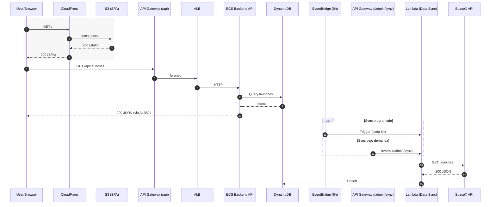

```mermaid
sequenceDiagram
autonumber
participant U as User/Browser
participant CF as CloudFront
participant S3 as S3 (SPA)
participant G as API Gateway (/api)
participant ALB as ALB
participant API as ECS Backend API
participant DDB as DynamoDB
participant EB as EventBridge (6h)
participant GS as API Gateway (/admin/sync)
participant L as Lambda (Data Sync)
participant SX as SpaceX API

rect rgba(240,240,240,0.5)
U->>CF: GET /
CF->>S3: fetch assets
S3-->>CF: 200 (static)
CF-->>U: 200 (SPA)
end

U->>G: GET /api/launches
G->>ALB: forward
ALB->>API: HTTP
API->>DDB: Query launches
DDB-->>API: Items
API-->>U: 200 JSON (via ALB/G)

par Sync programado
  EB->>L: Trigger (cada 6h)
and Sync bajo demanda
  GS->>L: Invoke (/admin/sync)
end
L->>SX: GET launches
SX-->>L: 200 JSON
L->>DDB: Upsert
```
