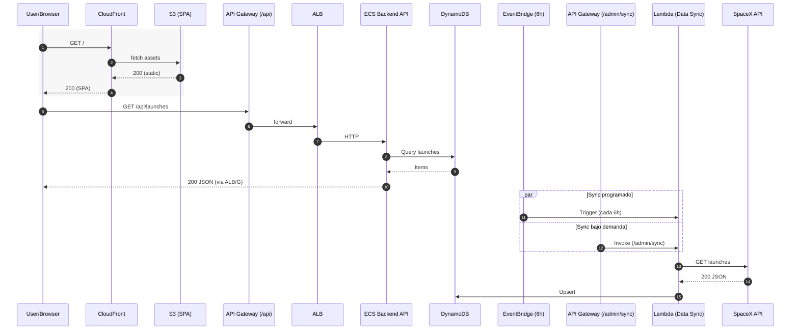

```mermaid
flowchart LR
  %% --- FRONTEND ---
  User[User / Browser]
  subgraph Frontend
    CF[CloudFront (CDN)]
    S3[S3 (Static SPA)]
  end

  User -->|GET /| CF -->|fetch SPA| S3

  %% --- BACKEND ---
  subgraph Backend
    APIGW[API Gateway (/api)]
    ALB[ALB]
    ECS[ECS Fargate (Backend API)]
    DDB[((DynamoDB))]
  end

  User -->|HTTPS /api/*| APIGW --> ALB --> ECS
  ECS <--> DDB

  %% --- DATA SYNC ---
  subgraph "Data Sync"
    EB[EventBridge (cron 6h)]
    APIGW_SYNC[API Gateway (/admin/sync)]
    L[Lambda (Data Sync)]
  end

  SpaceX[[SpaceX API (External)]]

  EB -->|trigger| L
  APIGW_SYNC -->|invoke| L
  L -->|GET launches| SpaceX
  L -->|upsert| DDB

  %% opcional: enriquecimiento directo en tiempo real
  ECS -. optional enrich .-> SpaceX
```


